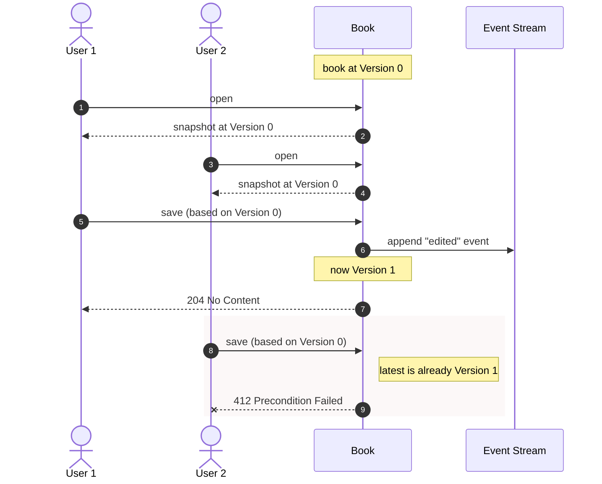

# Applying Optimistic Locking

-----

**NOTE**

This tutorial assumes you have completed the official [OpenCQRS tutorial](https://docs.opencqrs.com/tutorials/).

-----

When two users edit the same record at the same time, the naive answer is "last write wins" — one of the two updates is silently lost. Optimistic locking refuses that outcome: each writer declares the version they read, and any write whose declared version no longer matches the current one is rejected.

In an event-sourced aggregate, the version is free. It is the **id of the most recent event on the aggregate's stream** — every successful write appends a new event, so the id always advances. No counter, no separate column, no clock skew. Write model and read model agree by construction because both pick the same `Event rawEvent` out of the framework.

## How the Version Comes Into Being

The first command on a brand-new subject is `PurchaseBookCommand`. The handler publishes a single `BookPurchasedEvent`; EventSourcingDB stores it and assigns it a unique id. From this moment, that id *is* the book's version. Both sides of the read/write split pull it from `Event rawEvent`:

```java
@StateRebuilding
public Book on(BookPurchasedEvent e, Event rawEvent) {
    return new Book(rawEvent, e.isbn(), e.title(), List.copyOf(e.authors()));
}
```

Every subsequent write appends a new event, and its id becomes the record's new version.

## Asking Every Writer for Their Version

OpenCQRS does not ship a versioning contract, so the sample wires one up in user code: two small interfaces — `Versioned` for state, `VersionedCommand` for commands that carry an `expectedVersion`. The check itself lives once, as a default method:

```java
public interface VersionedCommand extends Command {
    String expectedVersion();

    default void assertVersionMatches(Versioned state) {
        if (expectedVersion() == null || expectedVersion().isBlank())
            throw new IllegalArgumentException("expectedVersion must not be blank");
        if (!expectedVersion().equals(state.version()))
            throw new ConcurrentModificationException(
                    "Expected version " + expectedVersion() + " but found " + state.version());
    }
}
```

Keeping `VersionedCommand` **opt-in** is deliberate. `PurchaseBookCommand` creates a brand-new subject and has no prior version to compare against — it should not carry an `expectedVersion` at all. Folding the field into every `Command` would invert the safer setting and make locking opt-out.

The edit handler then delegates the check before doing anything else, and skips the publish when nothing actually changed — so the version does not advance for a no-op save:

```java
@CommandHandling
public void handle(Book book, EditBookDetailsCommand cmd, CommandEventPublisher<Book> publisher) {
    cmd.assertVersionMatches(book);
    if (book.title().equals(cmd.title()) && book.authors().equals(cmd.authors())) return;
    publisher.publish(new BookDetailsEditedEvent(cmd.isbn(), cmd.title(), cmd.authors()));
}
```

## Where the Lock Actually Lives

The real protection sits in the storage layer. Every write OpenCQRS appends to EventSourcingDB carries `SubjectIsOnEventId(currentTip)`, and the store rejects the append atomically if the tip has moved. That alone is sufficient to keep the event log consistent — no race can slip past it.

The handler-level `assertVersionMatches` is **not** a second safety net. Its job is to give the **client** a fast, deterministic signal that the state it is editing is stale, *before* any write is even attempted. The UI can then react meaningfully — reload the record, show a diff, prompt the user to merge — instead of catching a generic concurrency error after a round trip to the store. EventSourcingDB owns the *correctness*; the handler check exists for *user experience*.

## The Race

Two users open the same book at version 0. The first to save wins; the second is rejected because the version it declared no longer exists.



The same shape holds for anything else that carries a version — a wiki page, a customer profile, a configuration entry.

## Scope and Limitations

The locking contract is **per-subject** — the version is the id of the most recent event on that one stream (`/books/{isbn}`). It does not extend to the collection `/books`, because there is no `max(event.id)` across independent streams, and it does not extend to individual fields of a subject.

For **per-field** locking ("two users editing different fields of the same book at the same time"), the natural event-sourcing answer is to decompose the subject — model each independently-versioned slice as its own stream (`/books/{isbn}/title`, `/books/{isbn}/authors`) — so each slice gets its own `version()` for free. Splitting a wide command into narrower per-field commands often resolves the same need at the domain level, without any locking machinery at all.

## Running the App

To run the app, ensure you have [Docker](https://www.docker.com/) installed on your system as well as being logged into the [GitHub Container Registry](https://docs.github.com/de/packages/working-with-a-github-packages-registry/working-with-the-container-registry#authentifizieren-bei-der-container-registry).

Then run:

```bash
docker-compose up
```

This command will start:

- An instance of EventSourcingDB.
- An instance of the app itself.

To interact with the app, we provide a [collection](clients) of requests for the [Bruno](https://www.usebruno.com/) API client.
