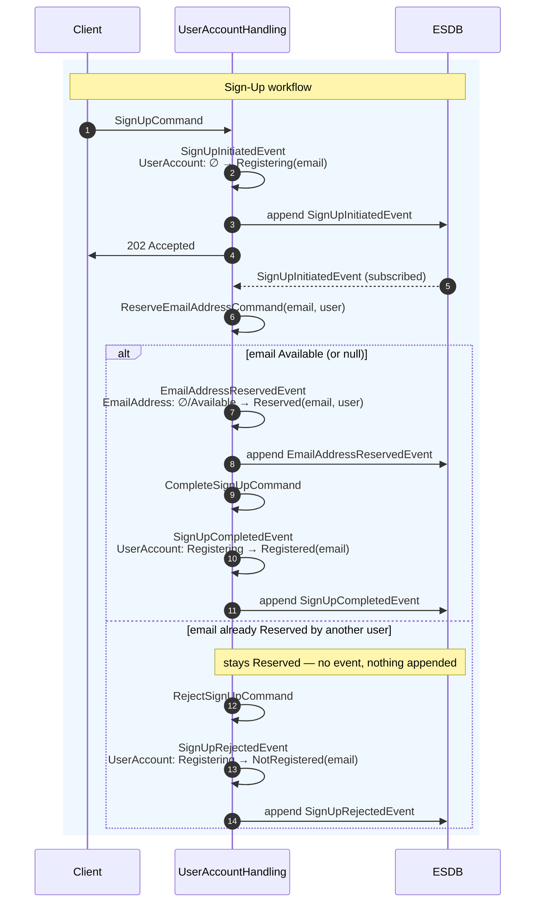
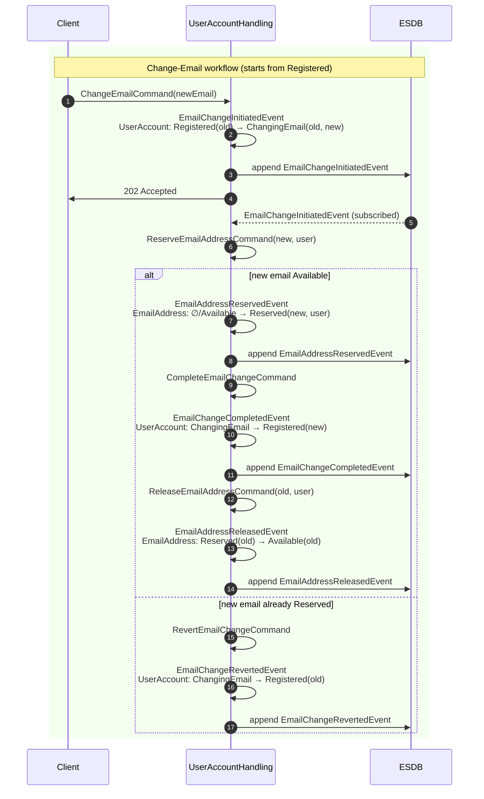

# Enforcing Cross-Aggregate Uniqueness with the Reservation Pattern

-----

**NOTE**

This tutorial assumes you have completed the official [OpenCQRS tutorial](https://docs.opencqrs.com/tutorials/).

-----

Some invariants don't fit inside a single aggregate. "An email address must be unique across all users" is the classic example: no single `UserAccount` can prove the constraint, because the proof requires knowing what every *other* `UserAccount` has already used.

OpenCQRS makes this very direct. A `@CommandHandling` method operates on **exactly one** subject — the one returned by the command's `getSubject()`. Its `CommandEventPublisher<T>` queues events for that subject and commits them atomically when the handler returns. There is no API for publishing events to another subject within the same transaction, and EventSourcingDB has no multi-subject transactions to begin with. Any constraint that spans two aggregates must therefore be enforced by **coordinating** them, not by checking inside one.

## The Reservation Pattern

The Reservation Pattern solves this by promoting the contested resource — the email address — into its own aggregate. `UserAccount` no longer owns the uniqueness constraint; it *asks* `EmailAddress` to reserve the value on its behalf:

- `/user-accounts/{username}` carries identity and lifecycle.
- `/email-addresses/{hash(email)}` is an **index aggregate**: a per-value slot whose only job is to be either *Reserved by a user* or *Available*.

Uniqueness now has a single source of truth. Whichever caller's `ReserveEmailAddressCommand` reaches the slot first wins it; the second caller sees `Reserved` and is rejected. Two users can never simultaneously hold the same email because two commands can never simultaneously hold the same subject.

### Difference from a Saga

A saga also coordinates across aggregates, so the distinction is worth making explicit:

- A **saga** drives a *business workflow* end-to-end — typically several independent steps, each potentially compensable (place order → reserve stock → charge payment → ship). The saga itself usually exists as a third aggregate that owns the workflow state, because the workflow has to remember *where it is*.
- The **reservation pattern** has one job: prove a uniqueness invariant. There is no workflow state to remember between steps, no third aggregate, and the only "compensation" is the trivial release of a slot. The orchestration lives on the source aggregate's own `@EventHandling` methods.

If you find yourself needing a third aggregate to hold "where we are in the process," you have crossed from a reservation into a saga. The [implementing-sagas](../implementing-sagas) sample covers that case.

## Eventual Consistency Across Aggregates

Because a command handler can only modify one subject, coordination has to happen *between* commands. OpenCQRS gives two primitives for this:

- **Inside the handler:** `publisher.publish(event)` queues an event on the *current* subject. All queued events commit atomically when the handler returns.
- **Across aggregates:** `@EventHandling` methods run on the asynchronous `EventHandlingProcessor` after each committed event. From there, `commandRouter.send(otherCommand)` dispatches a fresh command — running in its own transaction, on whatever subject *that* command names.

The chain is therefore *event → handler → command → event*, each step atomic only within its own subject. Between the first command and the final state, the system is **eventually consistent**: there is a window in which `UserAccount` already says "Registering" but `EmailAddress` has not yet been reserved. The pattern compensates for that window in two ways.

First, the source aggregate models the in-flight state explicitly. `UserAccount` has a `sealed` `Status`:

```java
public sealed interface Status {
    record Registering(String email)                    implements Status {}
    record Registered(String email)                     implements Status {}
    record ChangingEmail(String email, String newEmail) implements Status {}
    record NotRegistered(String email)                  implements Status {}
}
```

Every command handler is an exhaustive `switch` over `Status`, so every off-flow case is a deliberate no-op rather than an accident. The compiler refuses to build when a case is missing — which is what makes the second mechanism work.

Second, every handler is **idempotent**. Re-delivering a `CompleteSignUpCommand` to an already-`Registered` account hits a no-op branch and emits no event; re-running the reservation against an already-owned slot returns `true` without re-publishing. That is what makes the framework's at-least-once delivery and full event replay safe — the orchestration converges to the same final state whether each step runs once or several times.

## The Two Aggregates

`UserAccount` is addressed by `/user-accounts/{username}`. Uniqueness of the username itself is the easy case: `SubjectCondition.PRISTINE` on `SignUpCommand` makes the framework reject the command before the handler ever runs if the subject already has events. Uniqueness of the *email* is the hard case — that is what the rest of this sample is about.

`EmailAddress` is addressed by `/email-addresses/{sha256(email)}`. The hash is a workaround for [EventSourcingDB's subject character rules](https://docs.eventsourcingdb.io/fundamentals/subjects/) — `@` and `.` are not allowed inside a path segment. The reservation handler is scoped to its own subject with `SourcingMode.LOCAL` and returns a boolean rather than throwing, so the caller in `UserAccountHandling` can branch directly:

```java
return switch (state) {
    case null,
         EmailAddress.Available _                                                    -> { publisher.publish(reservedEvent); yield true; }
    case EmailAddress.Reserved r when r.username().equals(command.username())        -> true;   // already owned by caller
    case EmailAddress.Reserved _                                                     -> false;  // held by someone else
};
```

The two `Reserved` cases encode the idempotency pivot: re-delivery by the same user is silently accepted; contention by a different user is denied; in both cases no event is appended.

## Workflows

Both workflows are orchestrated inside `UserAccountHandling`. The class hosts the command handlers, the `@StateRebuilding` methods, and the `@EventHandling("user")` methods that subscribe to committed events and dispatch follow-up commands. The two aggregates are not drawn as separate swim lanes — every state transition happens inside `UserAccountHandling`, so each one is shown as a self-arrow annotated with the affected aggregate. The `202 Accepted` reply is drawn as a solid arrow because, unlike a typical synchronous return, its outcome is not yet decided at the point the controller returns.

### Sign-Up

The client posts `SignUpCommand`. The handler publishes `SignUpInitiatedEvent`, moving `UserAccount` to `Registering(email)`. The async leg picks up the event, dispatches `ReserveEmailAddressCommand`, and — based on the returned boolean — dispatches either `CompleteSignUpCommand` (settles in `Registered`) or `RejectSignUpCommand` (settles in the explicit terminal state `NotRegistered`). Modelling the rejection as a state rather than the absence of state is what lets `GET /api/user-accounts/{username}` observe it.



### Change-Email

Starts from `Registered`. Unlike sign-up, the synchronous guard cannot be a `SubjectCondition` — uniqueness against a *new* email is precisely what the index aggregate exists to check. `ChangeEmailCommand` branches exhaustively over `Status` and throws typed domain exceptions for the non-`Registered` cases. On the happy path, `UserAccount` transitions to `ChangingEmail(old, new)` — carrying *both* addresses in this status is what makes the later revert and release possible without rereading prior events.

The async leg reserves the **new** address through the same reservation handler. On success, `CompleteEmailChangeCommand` moves `UserAccount` to `Registered(new)`; a separate `@EventHandling` on `EmailChangeCompletedEvent` then dispatches `ReleaseEmailAddressCommand` to free the **old** address. On denial, `RevertEmailChangeCommand` rolls the status back to `Registered(old)` — no release is needed because the old address never stopped being the caller's.



## Running the App

To run the app, ensure you have [Docker](https://www.docker.com/) installed on your system as well as being logged into the [GitHub Container Registry](https://docs.github.com/de/packages/working-with-a-github-packages-registry/working-with-the-container-registry#authentifizieren-bei-der-container-registry).

Then run:

```bash
docker-compose up
```

This command will start:

- An instance of EventSourcingDB.
- An instance of the app itself.

To interact with the app, we provide a [collection](clients) of requests for the [Bruno](https://www.usebruno.com/) API client.
