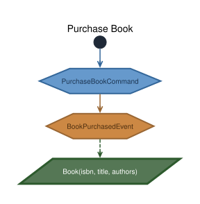
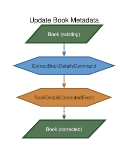
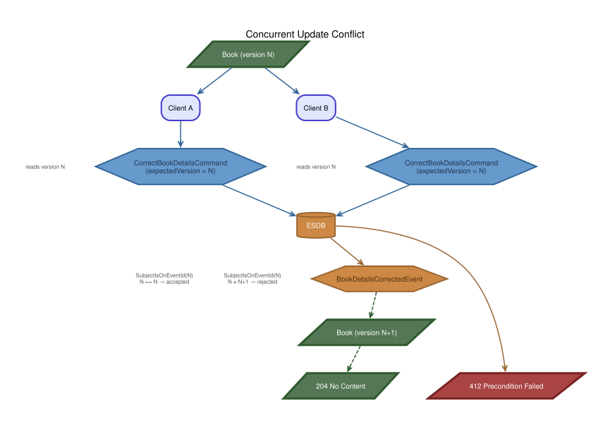

# Optimistic Locking

-----

**NOTE**

This tutorial assumes you have completed the official [OpenCQRS-tutorial](https://docs.opencqrs.com/tutorials/).

-----

Any system that lets multiple clients modify the same resource concurrently must decide what happens when two clients start from the same version and both try to commit. The naive answer is "last write wins", which silently loses one update. The correct answer is to reject the second write and tell the client to reload and retry.

This sample demonstrates how EventSourcingDB provides optimistic locking out of the box — using the event stream's own event IDs as the version.

## The Event ID Is the Version

Every event in EventSourcingDB has a unique `id` (a hash). The framework passes this as `Event rawEvent` to both `@StateRebuilding` and `@EventHandling` methods. This id becomes the version — no manual counter needed:

```java
@StateRebuilding
public Book on(Book book, BookDetailsCorrectedEvent e, Event rawEvent) {
    return new Book(rawEvent.id(), book.isbn(), e.title(), List.copyOf(e.authors()));
}
```

Write model and read model carry the same version because they both derive it from the same source: the raw event.

## Eventual Consistency

The client's view is never guaranteed to be current. Whether the client reads from the projection (fast, asynchronous) or from the write model via `GetBookCommand` (current, but replays the full event stream) — between reading and writing, another client may have updated the resource. This is a fundamental property of any distributed system: pages, REST APIs, mobile apps — the client side is always eventually consistent at best.

The version lets the system detect when the client's view has gone stale.

## Two Layers of Protection

### 1. Version Check in the Handler

The handler compares `expectedVersion` (sent by the client) against `book.version()` (rebuilt from the event stream). If they don't match, a `ConcurrentModificationException` is thrown — mapped to **412 Precondition Failed**. This gives a clear, application-level error.

### 2. Event Stream Precondition in EventSourcingDB

Even if two concurrent requests pass the handler check simultaneously (both read the same version), EventSourcingDB catches the race. Every write carries a `SubjectIsOnEventId` precondition. If another writer committed in between, the write is rejected and `ConcurrencyException` is thrown — also mapped to **412**.

The handler check is the fast, informative path. The ESDB precondition is the final safety net.

## REST API

| Method | Path | Description |
|--------|------|-------------|
| `POST` | `/api/books` | Purchase a new book. Returns `201` or `409` if ISBN exists. |
| `GET` | `/api/books/{isbn}` | Read via write model (command). Returns body + `ETag` header. |
| `GET` | `/api/books/{isbn}/projected` | Read from projection. Returns body + `ETag` header. Eventually consistent. |
| `PUT` | `/api/books/{isbn}` | Correct book details. Body: `{ title, authors, version }`. Returns `204`, `412`, or `404`. |

Both GET endpoints return the version as an `ETag` response header, so standard HTTP clients can track it.

## Commands and Events

**PurchaseBookCommand** — creates a new book. `SubjectCondition.PRISTINE` rejects duplicate ISBNs. Publishes `BookPurchasedEvent`.

**CorrectBookDetailsCommand** — corrects a book's title and/or authors after a cataloging error. Carries `expectedVersion` (the event ID the client last read). The handler rejects stale versions. Publishes `BookDetailsCorrectedEvent`.

**GetBookCommand** — returns the current `Book` write model including `version`. No event published.

## Workflows

### Purchase Book



### Correct Book Details



### Concurrent Update Conflict



Both clients read the same Book at version N. Client A's `CorrectBookDetailsCommand` reaches EventSourcingDB first. The write carries `SubjectIsOnEventId(N)` as a precondition. Since the event stream is still at N, the precondition holds — the event is committed and the stream advances to N+1.

Client B's command arrives moments later with the same precondition: `SubjectIsOnEventId(N)`. But the stream is now at N+1. The precondition fails, ESDB rejects the write, and the framework throws `ConcurrencyException` — mapped to **412 Precondition Failed**. Client B must reload the book (now at version N+1), review the changes Client A made, and decide whether to retry.

## Abstracting the Version Pattern

The version-via-event-ID pattern used here (see also the [spring-demo-library](https://github.com/dxfrontiers/spring-demo-library)) could be further abstracted:

- **`Event rawEvent` → version extraction** is already a framework feature. A custom `@Versioned` annotation on a state record could auto-populate the version field from `rawEvent.id()` at the `@StateRebuilding` level — removing the manual wiring.
- **ETag / If-Match** is the HTTP-native version mechanism. Instead of putting `version` in the JSON body, the client could send `If-Match: "<event-id>"` and a `HandlerInterceptor` could extract and validate it before the controller runs.
- **`@VersionChecked` on handler methods** could automate the `if (!version.equals(expected)) throw` check via AOP — reducing the handler to pure business logic.

All three share the same principle: the event ID is the single source of truth, and every layer (state, projection, REST) just passes it through.

## Running the App

To run the app, ensure you have [Docker](https://www.docker.com/) installed on your system as well as being logged into the [GitHub Container Registry](https://docs.github.com/de/packages/working-with-a-github-packages-registry/working-with-the-container-registry#authentifizieren-bei-der-container-registry).

Then run:

```bash
docker-compose up
```

This command will start:

- An instance of EventSourcingDB.
- An instance of the app itself.

To interact with the app, we provide the [`test-api.sh`](test-api.sh) script that demonstrates a versioned update, a stale-version 412 rejection, and the edge cases (404, 409).
