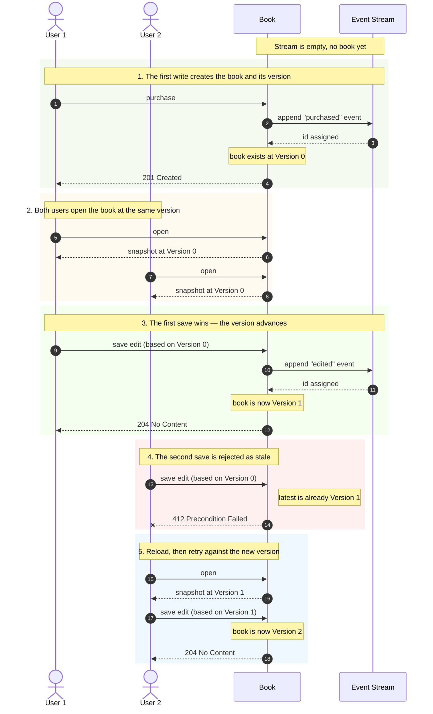

# Optimistic Locking on a Single Aggregate Stream

-----

**NOTE**

This tutorial assumes you have completed the official [OpenCQRS tutorial](https://docs.opencqrs.com/tutorials/).

-----

When two users edit the same record at the same time, the naive answer is "last write wins" — and one of the two updates is silently lost. The correct answer is to give the record a **version**, ask every writer to declare which version they read, and reject any write that no longer matches.

In an event-sourced aggregate the version is free: it is the **id of the most recent event on the aggregate's stream**. No counter, no separate column, no clock skew — and write model and read model agree by construction because they both derive the version from the same `Event rawEvent`.

## The Aggregate

The [`Book`](src/main/java/com/example/cqrs/domain/Book.java) aggregate is addressed via `/books/{isbn}` and implements [`Versioned`](src/main/java/com/example/cqrs/domain/api/Versioned.java) to expose its current version to the contract layer. Two commands act on it:

- [`PurchaseBookCommand`](src/main/java/com/example/cqrs/domain/api/command/PurchaseBookCommand.java) — creates the book and, with it, its first version. Uses [`SubjectCondition.PRISTINE`](https://docs.opencqrs.com/reference/extension_points/command_handler/), so a duplicate ISBN is rejected with **409 Conflict**.
- [`EditBookDetailsCommand`](src/main/java/com/example/cqrs/domain/api/command/EditBookDetailsCommand.java) — edits title and/or authors. Implements [`VersionedCommand`](src/main/java/com/example/cqrs/domain/api/command/VersionedCommand.java) (carries `expectedVersion`) and [`ValidatedCommand`](src/main/java/com/example/cqrs/domain/api/command/ValidatedCommand.java) (rejects blank fields). Returns **204** on success, **400** on a malformed payload, **404** for an unknown ISBN, and **412** for a stale version. The two contracts are orthogonal — a command opts into either, both, or neither.

`Versioned`, `VersionedCommand` and `ValidatedCommand` are demo-level interfaces; they are *not* part of the OpenCQRS framework and pull no extra dependencies. They sketch what an OpenCQRS-level abstraction would look like next to `com.opencqrs.framework.command.Command`.

## How a Version Comes Into Being and How It Survives a Race

The first command on a brand-new subject is `PurchaseBookCommand`. The handler publishes a single `BookPurchasedEvent`; ESDB stores it and assigns it a unique id. From this moment on, that id *is* the book's version — both the write-model `Book` (rebuilt by `@StateRebuilding`) and the read-model `BookView` (updated by `@EventHandling`) carry it as their `version()` field. Every subsequent write appends a new event whose id becomes the record's new version.

`EditBookDetailsCommand` carries an `expectedVersion` field — the version the user observed when they opened the record. The handler delegates the comparison to a single default method on `VersionedCommand`:

```java
@CommandHandling
public void handle(Book book, EditBookDetailsCommand cmd, CommandEventPublisher<Book> publisher) {
    cmd.validate();
    cmd.verifyAgainst(book);
    if (book.title().equals(cmd.title()) && book.authors().equals(cmd.authors())) return;
    publisher.publish(new BookDetailsEditedEvent(cmd.isbn(), cmd.title(), cmd.authors()));
}
```

`verifyAgainst(book)` throws `ConcurrentModificationException` on mismatch and is mapped to **412** by [`ApiExceptionHandler`](src/main/java/com/example/cqrs/http/ApiExceptionHandler.java). `validate()` throws `IllegalArgumentException` on a malformed payload and is mapped to **400**. The diff guard skips the publish when nothing actually changed.

The diagram below stays at the level of two users acting on a book — the same flow you exercise via the Bruno collection or `test-api.sh`. Anything else that holds a version (a wiki page, a customer profile, a configuration entry) behaves identically.



Two takeaways:

1. **Each successful save bumps the version.** The book itself is the single source of truth for "what version are you on now?".
2. **A user can only save against the version they actually saw.** If somebody else saved in between, the system refuses the second save instead of silently overwriting.

## Versioning Is Per-Subject, Not Per-Collection

The optimistic-locking contract is per **subject** — the path-like id of a single ESDB stream. In this sample the subject is `/books/{isbn}`: each book copy is one stream, and the book's version is the id of the most recent event on that stream. Individual events have their own ids, but those ids never act as the aggregate's version on their own; they are children of the parent subject, and the parent's stream tip is what writes are validated against.

There is **no** `max(event.id)` across a collection of subjects. ESDB's recursive read returns events from many independent streams, and combining their ids would be meaningless because the streams are not totally ordered. Optimistic locking is therefore per-stream by construction — coordinating across streams is a saga-shaped problem, not a versioning one.

## Two Layers of Protection

1. **Handler-level version check.** `cmd.verifyAgainst(book)` runs first, gives a fast and informative `412` to a stale client, and never reaches the event store.
2. **ESDB precondition.** Every write the framework appends to ESDB carries `SubjectIsOnEventId(currentTip)`. If two requests pass the handler check simultaneously and both try to commit, ESDB rejects the second one and the framework throws `ConcurrencyException` — also mapped to **412**. This is the final safety net that closes the race the handler check cannot close on its own.

## Running the App

To run the app, ensure you have [Docker](https://www.docker.com/) installed on your system as well as being logged into the [GitHub Container Registry](https://docs.github.com/de/packages/working-with-a-github-packages-registry/working-with-the-container-registry#authentifizieren-bei-der-container-registry).

Then run:

```bash
docker-compose up
```

This command will start:

- An instance of EventSourcingDB.
- An instance of the app itself.

To interact with the app, we provide a [collection](clients) of requests for the [Bruno](https://www.usebruno.com/) API client. Run the twelve requests in order to reproduce the version progression V1 → V2 → V3 → V4 and to exercise the `412`, `404` and `409` failure modes; the three GETs capture the latest `version` into a Bruno variable so the subsequent PUTs can reuse it.
