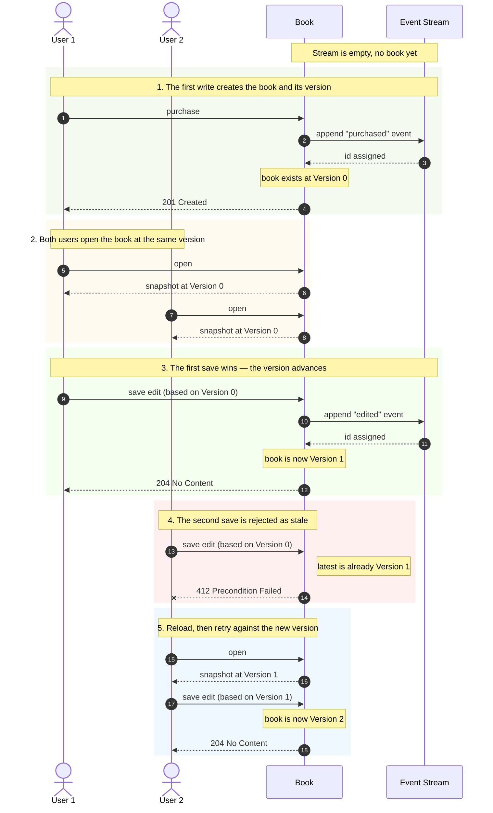

# Versioning a Subject in the Read Model

-----

**NOTE**

This tutorial assumes you have completed the official [OpenCQRS tutorial](https://docs.opencqrs.com/tutorials/).

-----

When two users edit the same record at the same time, the naive answer is "last write wins" — and one of the two updates is silently lost. The correct answer is to give the record a **version**, ask every writer to declare which version they read, and reject any write that no longer matches.

In an event-sourced aggregate the version is free: it is the **id of the most recent event on the aggregate's stream**. No counter, no separate column, no clock skew — and write model and read model agree by construction because they both derive the version from the same `Event rawEvent`.

## What Kind of Optimistic Locking Is This?

Conceptually closest to a *force-increment*-style optimistic lock: every successful write produces a new event whose id becomes the new version, so the version always advances. For an overview of the different optimistic-locking flavours, see Baeldung's [*Optimistic Locking in JPA*](https://www.baeldung.com/jpa-optimistic-locking).

## The Aggregate

The [`Book`](src/main/java/com/example/cqrs/domain/Book.java) aggregate is addressed via `/books/{isbn}` and implements [`Versioned`](src/main/java/com/example/cqrs/domain/api/Versioned.java) to expose its current version to the contract layer. Two commands act on it:

- [`PurchaseBookCommand`](src/main/java/com/example/cqrs/domain/api/command/PurchaseBookCommand.java) — creates the book and, with it, its first version. Uses [`SubjectCondition.PRISTINE`](https://docs.opencqrs.com/reference/extension_points/command_handler/), so a duplicate ISBN is rejected with **409 Conflict**.
- [`EditBookDetailsCommand`](src/main/java/com/example/cqrs/domain/api/command/EditBookDetailsCommand.java) — edits title and/or authors. Implements [`VersionedCommand`](src/main/java/com/example/cqrs/domain/api/command/VersionedCommand.java) (carries `expectedVersion`). Returns **204** on success, **400** when `expectedVersion` is missing, **404** for an unknown ISBN, and **412** for a stale version.

`Versioned` and `VersionedCommand` are demo-level interfaces; they are *not* part of the OpenCQRS framework and pull no extra dependencies. They sketch what an OpenCQRS-level abstraction would look like next to `com.opencqrs.framework.command.Command`. Making `VersionedCommand` an **opt-in** contract is deliberate: a `PurchaseBookCommand` that creates a brand-new subject has no prior version to compare against and therefore should not carry an `expectedVersion` field at all. Folding the version into every `Command` with a nullable default would invert the safer default — locking would become opt-out instead of opt-in. The default method `VersionedCommand.assertVersionMatches(state)` then lives once and is reused by every versioned command. Input-shape validation (blank titles, empty author lists) is intentionally out of scope for this sample — in a real Spring app it belongs at the HTTP boundary (Bean Validation / `@Valid`), not in the locking layer.

## How a Version Comes Into Being and How It Survives a Race

The first command on a brand-new subject is `PurchaseBookCommand`. The handler publishes a single `BookPurchasedEvent`; ESDB stores it and assigns it a unique id. From this moment on, that id *is* the book's version — both the write-model `Book` (rebuilt by `@StateRebuilding`) and the read-model `BookView` (updated by `@EventHandling`) carry it as their `version()` field. Every subsequent write appends a new event whose id becomes the record's new version.

`EditBookDetailsCommand` carries an `expectedVersion` field — the version the user observed when they opened the record. The handler delegates the comparison to a single default method on `VersionedCommand`:

```java
@CommandHandling
public void handle(Book book, EditBookDetailsCommand cmd, CommandEventPublisher<Book> publisher) {
    cmd.assertVersionMatches(book);
    if (book.title().equals(cmd.title()) && book.authors().equals(cmd.authors())) return;
    publisher.publish(new BookDetailsEditedEvent(cmd.isbn(), cmd.title(), cmd.authors()));
}
```

`assertVersionMatches(book)` throws `ConcurrentModificationException` on a version mismatch (mapped to **412** by [`ApiExceptionHandler`](src/main/java/com/example/cqrs/http/ApiExceptionHandler.java)) and `IllegalArgumentException` if `expectedVersion` is missing (mapped to **400**). The diff guard skips the publish when nothing actually changed.

The diagram below stays at the level of two users acting on a book — the same flow you exercise via the Bruno collection or `test-api.sh`. Anything else that holds a version (a wiki page, a customer profile, a configuration entry) behaves identically.



Two takeaways:

1. **Each successful save bumps the version.** The book itself is the single source of truth for "what version are you on now?".
2. **A user can only save against the version they actually saw.** If somebody else saved in between, the system refuses the second save instead of silently overwriting.

## Scope and Limitations

The locking contract is **per-subject** — the version is the id of the most recent event on that one ESDB stream (`/books/{isbn}`). It does not extend to the collection `/books` (there is no `max(event.id)` across independent streams; ESDB cannot supply one), and it does not extend to individual fields of a subject. If a collection-wide version is genuinely needed, it has to be materialised separately — for instance via a small relational side-table that records the latest child event id per parent subject, updated transactionally from the projection. That is intentionally not implemented here.

For **per-field** versioning ("two users editing different fields of the same book at the same time"), the natural event-sourcing answer is to decompose the subject — model each independently-versioned slice as its own stream (e.g. `/books/{isbn}/title`, `/books/{isbn}/authors`) — so that each slice gets its own `version()` for free. Splitting a wide command into narrower per-field commands often resolves the same need at the domain level, without any locking machinery at all.

## Where the Lock Actually Lives

The real protection sits in the storage layer: every write the framework appends to ESDB carries `SubjectIsOnEventId(currentTip)`, and ESDB rejects the append atomically if the tip has moved. The framework surfaces that as `ConcurrencyException`, which `ApiExceptionHandler` maps to **412**. That alone is sufficient to keep the event log consistent — no race can slip past it.

The handler-level `cmd.assertVersionMatches(book)` is *not* there to add a second safety net; ESDB does not need one. Its job is to give the **frontend** a fast, deterministic signal that the state it is editing is stale, before any write is even attempted. The UI can then react meaningfully — reload the record, show a diff, prompt the user to merge — instead of catching a generic concurrency error after a round trip to the store. In other words: ESDB owns the *correctness*; the handler check exists for *user experience*.

## Running the App

To run the app, ensure you have [Docker](https://www.docker.com/) installed on your system as well as being logged into the [GitHub Container Registry](https://docs.github.com/de/packages/working-with-a-github-packages-registry/working-with-the-container-registry#authentifizieren-bei-der-container-registry).

Then run:

```bash
docker-compose up
```

This command will start:

- An instance of EventSourcingDB.
- An instance of the app itself.

If you instead want to run the app locally (e.g. via `./gradlew bootRun` or your IDE), only start EventSourcingDB:

```bash
docker-compose up esdb
```

Spring Boot's `spring-boot-docker-compose` integration also brings up EventSourcingDB automatically when you run the app locally.

To interact with the app, we provide a [collection](clients) of requests for the [Bruno](https://www.usebruno.com/) API client. Run the twelve requests in order to reproduce the version progression V1 → V2 → V3 → V4 and to exercise the `412`, `404` and `409` failure modes; the three GETs capture the latest `version` into a Bruno variable so the subsequent PUTs can reuse it.
