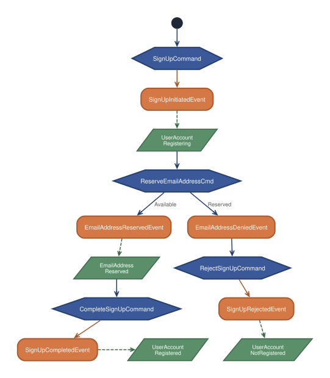
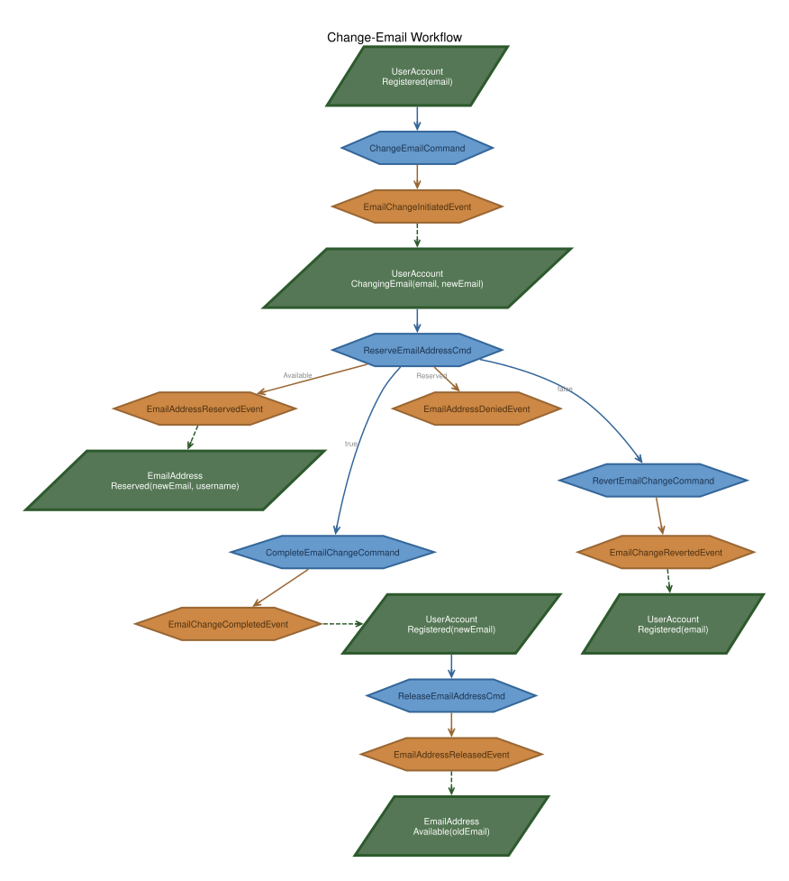

# Reservation Pattern: Cross-Aggregate Uniqueness via Idempotent Events

-----

**NOTE**

This tutorial assumes you have completed the official [OpenCQRS tutorial](https://docs.opencqrs.com/tutorials/).

-----

In an event-sourced system, each aggregate owns exactly one event stream and can only validate its own state — a constraint like "an email address must be unique system-wide" requires explicit coordination between two aggregates.

The **Reservation Pattern** solves this with a dedicated auxiliary aggregate acting as a lock, plus **asynchronous orchestration** via `@EventHandling`-driven child commands. No central saga; instead, **idempotent command handlers** guarantee safe coordination on retry, replay, and failure.

## The Two Aggregates

The [`UserAccount`](src/main/java/com/example/cqrs/domain/UserAccount.java) models user identity. Addressed via `/user-accounts/{username}`, uniqueness is enforced by [`SubjectCondition.PRISTINE`](https://docs.opencqrs.com/reference/extension_points/command_handler/) on [`SignUpCommand`](src/main/java/com/example/cqrs/domain/api/command/SignUpCommand.java). Sealed [`Status`](src/main/java/com/example/cqrs/domain/UserAccount.java): `Registering`, `Registered`, `ChangingEmail`, `NotRegistered`.

The [`EmailAddress`](src/main/java/com/example/cqrs/domain/EmailAddress.java) aggregate is a pure reservation mechanism. Addressed via `/email-addresses/{SHA256(email)}`, its states are `Reserved` and `Available`. The raw email is SHA-256-hashed because ESDB subjects only accept path segments matching a restricted character set (see [`ReserveEmailAddressCommand`](src/main/java/com/example/cqrs/domain/api/command/ReserveEmailAddressCommand.java) and the [EventSourcingDB subject rules](https://docs.eventsourcingdb.io/fundamentals/subjects/)) — `@` and `.` in email addresses would otherwise be rejected. A dedicated `Subject` value type is planned so this encoding no longer has to live inside every command. The [`Purpose`](src/main/java/com/example/cqrs/domain/api/Purpose.java) enum (`SIGN_UP` / `EMAIL_CHANGE`) is carried in the reservation/denial events so the async follow-up logic knows which `UserAccount` command to dispatch.

## Why asynchronous Command → Event → Command?

A command handler can atomically modify only one aggregate — events published via `publisher.publish(...)` are queued and committed as one batch on that handler's subject ([CommandRouter reference](https://docs.opencqrs.com/reference/core_components/command_router/)). There are no cross-subject transactions in EventSourcingDB.

Cross-aggregate orchestration therefore uses two primitives:

- **`publisher.publish(event)`** — queues an event on the **current** subject. Committed atomically when the handler returns.
- **`router.send(otherCommand)`** — dispatches a separate command to the aggregate owning `otherCommand.getSubject()`. Runs in its own transaction.

Here, `router.send` is invoked from **`@EventHandling("user")` methods** in [`UserAccountHandling`](src/main/java/com/example/cqrs/domain/UserAccountHandling.java). These run in the asynchronous `EventHandlingProcessor` ([reference](https://docs.opencqrs.com/reference/core_components/event_handling_processor/)) after the triggering event has been committed. The processor has per-group progress tracking and retry policies.

Consequence for the HTTP layer: since the outcome (`SignUpCompletedEvent` vs `SignUpRejectedEvent`) is established several async steps after the initial command, the [`UserController`](src/main/java/com/example/cqrs/http/UserController.java) returns **`202 Accepted`** and the client polls `GET /api/user-accounts/{username}` for the terminal state.

The controller methods themselves only ever build `accepted()` or `ok()` responses; all other status codes originate from exceptions that propagate out of `commandRouter.send(...)` and are translated by [`ApiExceptionHandler`](src/main/java/com/example/cqrs/http/ApiExceptionHandler.java), a Spring [`@RestControllerAdvice`](https://docs.spring.io/spring-framework/reference/web/webmvc/mvc-controller/ann-advice.html) whose [`@ExceptionHandler`](https://docs.spring.io/spring-framework/reference/web/webmvc/mvc-controller/ann-exceptionhandler.html) methods return `ProblemDetail` (RFC 9457). Two categories are handled:

- **Domain exceptions** thrown inside `@CommandHandling` when business rules reject the command — sealed hierarchies [`ChangeEmailRejectedException`](src/main/java/com/example/cqrs/domain/api/exception/ChangeEmailRejectedException.java) and [`SignUpRejectedException`](src/main/java/com/example/cqrs/domain/api/exception/SignUpRejectedException.java) only carry the error message. The HTTP status is decided in `ApiExceptionHandler` through an exhaustive pattern-matching `switch` over the sealed type — adding a new case requires one new subclass plus one new `switch` branch, and the compiler enforces exhaustiveness.
- **Framework exceptions** thrown by OpenCQRS when `SubjectCondition` checks fail — `CommandSubjectAlreadyExistsException` (`PRISTINE` violated, e.g. duplicate username) is mapped to `409 Conflict`, `CommandSubjectDoesNotExistException` (`EXISTS` violated) to `404 Not Found`.

Propagation is plain synchronous stack unwinding on the HTTP thread:

- Controller calls `commandRouter.send(command)` — blocks until events commit or an exception is thrown.
- The exception leaves `@CommandHandling` → `CommandRouter` → controller without any `try/catch` in between.
- Spring's `DispatcherServlet` catches it and the `ExceptionHandlerExceptionResolver` dispatches to the matching `@ExceptionHandler` in `ApiExceptionHandler`.
- The returned `ProblemDetail` is serialized to JSON; the HTTP status is taken from `ProblemDetail.getStatus()`.
- Exceptions thrown later in `@EventHandling` run on the `EventHandlingProcessor` thread and never reach the client — they are handled by the retry policy.

## Failure signalling: denial & revert

A naive implementation fails because the `EmailAddress` aggregate gives no signal back when a reservation is refused. Without such a signal the `UserAccount` stays stuck in `Registering` / `ChangingEmail`.

This implementation makes denial a **first-class event**:

- [`ReserveEmailAddressCommand` handler](src/main/java/com/example/cqrs/domain/UserAccountHandling.java) publishes `EmailAddressDeniedEvent` when the email is already owned by someone else.
- A dedicated [`@EventHandling("user")`](https://docs.opencqrs.com/reference/extension_points/event_handler/) on `EmailAddressDeniedEvent` dispatches **`RejectSignUpCommand`** (purpose `SIGN_UP`) or **`RevertEmailChangeCommand`** (purpose `EMAIL_CHANGE`).
- These commands transition the `UserAccount` to `NotRegistered` or back to `Registered(originalEmail)`.

The `Purpose` enum on the reservation/denial events lets one reservation aggregate serve both flows without coupling.

## Race conditions and replay

Optimistic locking is enforced by EventSourcingDB on every write: a write specifies the expected head event id (or `pristine`) and fails with a `ConcurrencyException` if the subject moved on in the meantime. The `CommandRouter` retries automatically with fresh state ([CommandRouter](https://docs.opencqrs.com/reference/core_components/command_router/)).

- **Two sign-ups for the same username** — both target `/user-accounts/alice` with `SubjectCondition.PRISTINE`. One wins; the other fails synchronously with `CommandSubjectAlreadyExistsException`, mapped to `409 Conflict`.
- **Two sign-ups for the same email, different usernames** — both `SignUpCommand` handlers succeed on their own `UserAccount` subjects. The two asynchronous `ReserveEmailAddressCommand` dispatches serialize on the shared `/email-addresses/{hash}` subject. One reservation succeeds → `SignUpCompletedEvent`. The other sees `Reserved` by a different user → `EmailAddressDeniedEvent` → `RejectSignUpCommand` → `SignUpRejectedEvent`.
- **Replay after restart** — `@StateRebuilding` handlers are pure functions over the event stream; states rebuild deterministically. Async `@EventHandling` re-processing is controlled by the per-group progress tracker, so `router.send` calls are only re-issued for events that have not yet been acknowledged.
- **Transient failures** — [`application.yml`](src/main/resources/application.yml) configures `exponential_backoff` retries for the `user` processing group (`max-attempts: 5`). If a downstream command keeps failing, the event is eventually shelved and must be investigated.

## Idempotency through preconditions

Every [command handler](src/main/java/com/example/cqrs/domain/UserAccountHandling.java) branches on the current state via an **exhaustive switch** on the sealed `Status` / `EmailAddress` interfaces. Each branch chooses one of three outcomes:

- **Publish** — the normal transition.
- **Idempotent skip** — the target state has already been reached; publishing again would produce duplicate events. Required because `@EventHandling` delivery is **at-least-once** — the same command may be dispatched a second time after a retry or restart.
- **Throw** — the state is unreachable through any normal or replayed flow; it signals a bug and must not be swallowed.

Examples:

- `ReserveEmailAddressCommand` on `Reserved` by the **same** user → return `true` without publishing. This is the retry/recovery case.
- `CompleteSignUpCommand` on `Registered` → skip silently. The second delivery must not produce a second `SignUpCompletedEvent`.
- `ChangeEmailCommand` on `Registering` → `throw SignUpPendingException`. This state cannot appear on any valid retry path.

The [`ReserveEmailAddressCommand` handler](src/main/java/com/example/cqrs/domain/UserAccountHandling.java) additionally uses `@CommandHandling(sourcingMode = SourcingMode.LOCAL)` so its state is rebuilt only from events on its own subject — the `EmailAddress` aggregate has no child subjects and LOCAL sourcing avoids unnecessary recursive reads.

## Workflows

The diagrams use three node shapes / colours to show the CQRS building blocks:

- **Blue hexagons** — commands (`@CommandHandling`)
- **Orange rectangles** — domain events
- **Green parallelograms** — aggregate states reconstructed via `@StateRebuilding`

### Sign-Up Workflow



The Change-Email workflow below picks up where Sign-Up ends: its starting state is `UserAccount Registered` — the terminal state of the successful Sign-Up branch. A `ChangeEmailCommand` on any other state is rejected synchronously.

### Change-Email Workflow



## Running the App

Requires [Docker](https://www.docker.com/) and a login to the [GitHub Container Registry](https://docs.github.com/de/packages/working-with-a-github-packages-registry/working-with-the-container-registry#authentifizieren-bei-der-container-registry).

```bash
docker-compose up
```

Starts EventSourcingDB and the application. Exercise the full flow with [`test-api.sh`](test-api.sh); because state transitions are async, the script issues `GET` requests after a short delay (`ASYNC_WAIT`, default 1s) to observe the terminal state.
