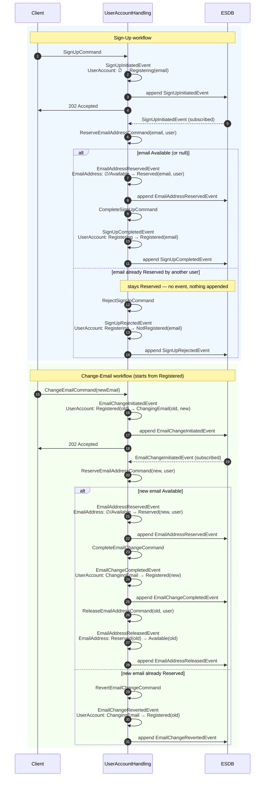

# Achieving Cross-Aggregate Consistency: The Reservation Pattern

-----

**NOTE**

This tutorial assumes you have completed the official [OpenCQRS tutorial](https://docs.opencqrs.com/tutorials/).

-----

In an event-sourced system, each aggregate owns exactly one event stream and can only validate its own state — a constraint like "an email address must be unique system-wide" requires explicit coordination between two aggregates.

The **Reservation Pattern** solves this with a dedicated **Index-Aggregate** acting as a lock, plus **asynchronous orchestration** via `@EventHandling`-driven child commands. No central saga; instead, **idempotent command handlers** guarantee safe coordination on retry, replay, and failure.

## The Two Aggregates

The [`UserAccount`](src/main/java/com/example/cqrs/domain/UserAccount.java) models user identity. Addressed via `/user-accounts/{username}`, uniqueness is enforced by [`SubjectCondition.PRISTINE`](https://docs.opencqrs.com/reference/extension_points/command_handler/) on [`SignUpCommand`](src/main/java/com/example/cqrs/domain/api/command/SignUpCommand.java) — the framework checks the subject's stream is empty before invoking the handler, so a duplicate username is rejected synchronously by `commandRouter.send(...)`. The aggregate's lifecycle is encoded in a sealed [`Status`](src/main/java/com/example/cqrs/domain/UserAccount.java) interface with four record variants: `Registering(email)` for an in-flight sign-up, `Registered(email)` for the steady state, `ChangingEmail(email, newEmail)` carrying both addresses while a change is in flight (what later makes the revert and old-address release possible without rereading prior events), and `NotRegistered(email)` as an *explicit* terminal state for a rejected sign-up — modelling the rejection as a state rather than absence of state is what lets `GET /api/user-accounts/{username}` observe it. `sealed` is what pays off downstream: every command handler in [`UserAccountHandling`](src/main/java/com/example/cqrs/domain/UserAccountHandling.java) is an exhaustive `switch` over `Status`, so the compiler refuses to build when a case is missing — that compile-time exhaustiveness is what the idempotency invariant later in this document rests on.

The [`EmailAddress`](src/main/java/com/example/cqrs/domain/EmailAddress.java) aggregate is a pure **Index-Aggregate** for email-address uniqueness: a reservation mechanism with two states, `Reserved` and `Available`. Addressed via `/email-addresses/{SHA256(email)}`, the raw email is SHA-256-hashed because ESDB subjects only accept path segments matching a restricted character set (see [`ReserveEmailAddressCommand`](src/main/java/com/example/cqrs/domain/api/command/ReserveEmailAddressCommand.java) and the [EventSourcingDB subject rules](https://docs.eventsourcingdb.io/fundamentals/subjects/)) — `@` and `.` in email addresses would otherwise be rejected. A dedicated `Subject` value type is planned so this encoding no longer has to live inside every command. The [`ReserveEmailAddressCommand`](src/main/java/com/example/cqrs/domain/api/command/ReserveEmailAddressCommand.java) handler returns a `boolean` — `true` if the address was reserved (or the caller already owned it), `false` if it is held by another user. The calling `@EventHandling` method already knows whether it's orchestrating a sign-up or an email change, so it can pick the right follow-up command itself.

## Why asynchronous Command → Event → Command?

A command handler can atomically modify only one aggregate — events published via `publisher.publish(...)` are queued and committed as one batch on that handler's subject ([CommandRouter reference](https://docs.opencqrs.com/reference/core_components/command_router/)). There are no cross-subject transactions in EventSourcingDB.

Cross-aggregate orchestration therefore uses two primitives:

- **`publisher.publish(event)`** — queues an event on the **current** subject. Committed atomically when the handler returns.
- **`router.send(otherCommand)`** — dispatches a separate command to the aggregate owning `otherCommand.getSubject()`. Runs in its own transaction and returns the handler's result to the caller.

Here, `router.send` is invoked from **`@EventHandling("user")` methods** in [`UserAccountHandling`](src/main/java/com/example/cqrs/domain/UserAccountHandling.java) (sign-up orchestrator: [`UserAccountHandling.java#L24-L31`](src/main/java/com/example/cqrs/domain/UserAccountHandling.java#L24-L31)). These run in the asynchronous `EventHandlingProcessor` ([reference](https://docs.opencqrs.com/reference/core_components/event_handling_processor/)) after the triggering event has been committed. The processor has per-group progress tracking and retry policies. The same handler then inspects the boolean returned by the reservation and dispatches the success-or-fail follow-up command directly, keeping the orchestration logic in one place.

The reservation itself lives on the index aggregate ([`UserAccountHandling.java#L152-L167`](src/main/java/com/example/cqrs/domain/UserAccountHandling.java#L152-L167)) and is exhaustive over the four possible incoming states. Only `null` and `Available` publish; the two `Reserved` options are the idempotency / denial pivot:

```java
case EmailAddress.Reserved r when r.username().equals(command.username()) -> true;   // already owned by caller, no event
case EmailAddress.Reserved _                                              -> false;  // held by someone else, no event
```

`SourcingMode.LOCAL` on that handler keeps it scoped to events on the `/email-addresses/{hash}` subject only ([SourcingMode reference](https://docs.opencqrs.com/reference/extension_points/command_handler/)).

Consequence for the HTTP layer: the terminal outcome is established several async steps after the initial command, so the [`UserController`](src/main/java/com/example/cqrs/http/UserController.java) returns **`202 Accepted`** and the client polls `GET /api/user-accounts/{username}` for the final state. Synchronous rejections — duplicate username, same-email, change on a disabled account, and similar — surface as exceptions from `commandRouter.send(...)` and are mapped to the appropriate HTTP status code by [`ApiExceptionHandler`](src/main/java/com/example/cqrs/http/ApiExceptionHandler.java). Failures that arise later inside `@EventHandling` stay on the processor thread and are covered by the retry policy, never the client response.

## Workflows

The lifecycle of both aggregates is captured in the sequence diagram below, with three actors: `Client`, [`UserAccountHandling`](src/main/java/com/example/cqrs/domain/UserAccountHandling.java) (the class hosting all command handlers, `@StateRebuilding` methods, and `@EventHandling("user")` orchestrators invoked by the framework's `EventHandlingProcessor`), and `ESDB` on the far right as the durable event store. The two aggregates `UserAccount` and `EmailAddress` are not drawn as their own swim lanes — every state change happens inside `UserAccountHandling`, so each transition is shown as a self-arrow on its lifeline annotated with the affected aggregate. The boolean returned by `ReserveEmailAddressCommand` drives the branch directly inside the `@EventHandling` method.

Self-arrows on the `UserAccountHandling` lifeline depict the `@StateRebuilding` step — every event causes a state change immediately at `publisher.publish(...)`, not only on the next command, with the affected aggregate (`UserAccount` or `EmailAddress`) annotated on the arrow. The corresponding **`append <Event>` arrow to ESDB** makes the persistence boundary explicit, and the dashed return from ESDB to `UserAccountHandling` shows the asynchronous subscription that drives the cross-aggregate orchestration. The `202 Accepted` reply to the client is drawn as a **solid** arrow rather than the usual dashed return: it is a synchronous status code, but unlike a typical return value its outcome is not yet decided at that point — whether the sign-up or email change actually succeeds is only established after the async leg completes.



### Sign-Up Workflow

The numbers below refer to the autonumbered steps in the diagram above.

**Synchronous part (steps 1–4).** The client `POST`s `SignUpCommand` (1). The duplicate-username guard sits *outside* the handler: [`SubjectCondition.PRISTINE`](src/main/java/com/example/cqrs/domain/api/command/SignUpCommand.java) on the command — the framework rejects the call before invoking the handler if the `/user-accounts/{username}` stream isn't empty. That's why a collision surfaces synchronously as an HTTP error and the handler stays trivial: it just publishes `SignUpInitiatedEvent`, which `@StateRebuilding` applies to take `UserAccount` from `∅` to `Registering(email)` (2). The event is appended to ESDB (3); [`UserController`](src/main/java/com/example/cqrs/http/UserController.java#L26-L30) returns `202 Accepted` (4) because the terminal outcome — completed or rejected — only materialises after the async leg.

**Async orchestration (steps 5–11 happy path).** ESDB pushes the appended event to [`UserAccountHandling#on(SignUpInitiatedEvent, …)`](src/main/java/com/example/cqrs/domain/UserAccountHandling.java#L24-L31) via subscription (5). The orchestrator fires `ReserveEmailAddressCommand` against the index aggregate (6). The reservation handler ([`UserAccountHandling.java#L152-L167`](src/main/java/com/example/cqrs/domain/UserAccountHandling.java#L152-L167)) publishes `EmailAddressReservedEvent` only on the `null`/`Available` options (7–8); the `Reserved`-by-same-user option returns `true` without publishing (idempotent re-delivery), and the `Reserved`-by-someone-else option returns `false`. On `true` the orchestrator dispatches `CompleteSignUpCommand` (9), which moves `UserAccount` to `Registered(email)` (10–11). Keeping orchestrator, reservation, and follow-up commands in the **same class** is the central design choice — the boolean stays a method-local variable, no Saga or global state survives between steps; the next command is decided right inside the event handler that observed the previous one.

**Denial branch (steps 12–14).** When the email is already reserved by another user, the handler returns `false` **without publishing anything** — that's why the diagram shows no `EmailAddressReservedEvent` self-arrow and no append in this branch. The orchestrator dispatches `RejectSignUpCommand` (12), and `UserAccount` settles in the explicit `NotRegistered(email)` terminal state (13–14) instead of an absence-of-state — that's what makes the rejected sign-up replayable and observable through `GET /api/user-accounts/{username}`.

**Idempotency invariant.** Every command handler in [`UserAccountHandling`](src/main/java/com/example/cqrs/domain/UserAccountHandling.java) is an exhaustive `switch` over `Status` (or `EmailAddress`), with a no-op option for every off-flow state. A re-fired `CompleteSignUpCommand` against an already-`Registered` account hits a no-op option and produces no event — and that is exactly what makes redelivery (under the framework's [retry policy](https://docs.opencqrs.com/reference/core_components/event_handling_processor/)) and full event replay safe.

### Change-Email Workflow

Starts from `Registered` — the terminal state of the successful sign-up branch. The pattern reuses the **same** `EmailAddress` index aggregate and the **same** orchestrator class.

**Synchronous gate (steps 15–18).** Unlike sign-up, the change-email guard cannot be expressed via `SubjectCondition` — uniqueness against a *new* email is exactly what the index aggregate is for. Instead, the [`ChangeEmailCommand` handler](src/main/java/com/example/cqrs/domain/UserAccountHandling.java#L71-L82) enumerates every `Status` and throws a typed domain exception (`SameEmailException`, `EmailChangeInProgressException`, `SignUpPendingException`, `AccountDisabledException`) for any non-`Registered` option; [`ApiExceptionHandler`](src/main/java/com/example/cqrs/http/ApiExceptionHandler.java) maps each one to the appropriate HTTP status before ESDB ever sees the request. On the happy option, `UserAccount` transitions to `ChangingEmail(old, new)` (16) — and the design choice that pays off later is **carrying both addresses** in this status: it is what makes the revert branch and the old-address release possible without rereading prior events.

**Happy path (steps 19–28).** The async leg mirrors sign-up: ESDB delivers the event (19), the orchestrator reserves the **new** address (20–22) using the same reservation handler. On `true`, `CompleteEmailChangeCommand` (23) takes `UserAccount` to `Registered(new)` (24–25). A *separate* [`@EventHandling` on `EmailChangeCompletedEvent`](src/main/java/com/example/cqrs/domain/UserAccountHandling.java#L121-L124) then frees the **old** address with `ReleaseEmailAddressCommand` (26–28). The release handler ([`UserAccountHandling.java#L174-L184`](src/main/java/com/example/cqrs/domain/UserAccountHandling.java#L174-L184)) only publishes when the caller still owns the reservation:

```java
case EmailAddress.Reserved r when r.username().equals(command.username()) ->
        publisher.publish(new EmailAddressReleasedEvent(command.email()));
```

The two other options (`Available` and `Reserved`-by-someone-else) are silent no-ops — re-delivery is harmless.

**Revert branch (steps 29–31).** On `false` — the new email is held by another user — `RevertEmailChangeCommand` (29) takes `UserAccount` back to `Registered(old)` (30–31). The old address stays reserved by this user, so no compensating release is needed; the only ESDB write in this branch is the revert event itself (31).

## Running the App

To run the app, ensure you have [Docker](https://www.docker.com/) installed on your system as well as being logged into the [GitHub Container Registry](https://docs.github.com/de/packages/working-with-a-github-packages-registry/working-with-the-container-registry#authentifizieren-bei-der-container-registry).

Then run:

```bash
docker-compose up
```

This command will start:

- An instance of EventSourcingDB.
- An instance of the app itself.

To interact with the app, we provide a [collection](clients) of requests for the [Bruno](https://www.usebruno.com/) API client.
