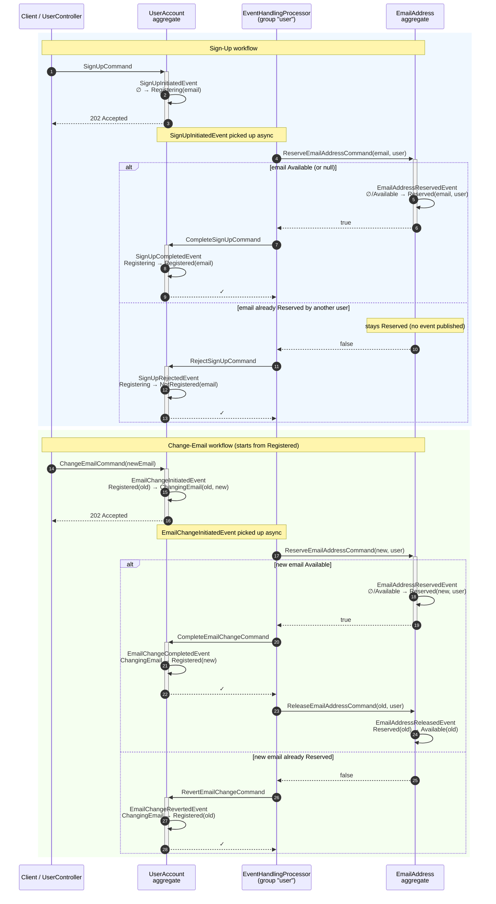

# Achieving Cross-Aggregate Consistency: The Reservation Pattern

-----

**NOTE**

This tutorial assumes you have completed the official [OpenCQRS tutorial](https://docs.opencqrs.com/tutorials/).

-----

In an event-sourced system, each aggregate owns exactly one event stream and can only validate its own state — a constraint like "an email address must be unique system-wide" requires explicit coordination between two aggregates.

The **Reservation Pattern** solves this with a dedicated **Index-Aggregate** acting as a lock, plus **asynchronous orchestration** via `@EventHandling`-driven child commands. No central saga; instead, **idempotent command handlers** guarantee safe coordination on retry, replay, and failure.

## The Two Aggregates

The [`UserAccount`](src/main/java/com/example/cqrs/domain/UserAccount.java) models user identity. Addressed via `/user-accounts/{username}`, uniqueness is enforced by [`SubjectCondition.PRISTINE`](https://docs.opencqrs.com/reference/extension_points/command_handler/) on [`SignUpCommand`](src/main/java/com/example/cqrs/domain/api/command/SignUpCommand.java). Sealed [`Status`](src/main/java/com/example/cqrs/domain/UserAccount.java): `Registering`, `Registered`, `ChangingEmail`, `NotRegistered`.

The [`EmailAddress`](src/main/java/com/example/cqrs/domain/EmailAddress.java) aggregate is a pure **Index-Aggregate** for email-address uniqueness: a reservation mechanism with two states, `Reserved` and `Available`. Addressed via `/email-addresses/{SHA256(email)}`, the raw email is SHA-256-hashed because ESDB subjects only accept path segments matching a restricted character set (see [`ReserveEmailAddressCommand`](src/main/java/com/example/cqrs/domain/api/command/ReserveEmailAddressCommand.java) and the [EventSourcingDB subject rules](https://docs.eventsourcingdb.io/fundamentals/subjects/)) — `@` and `.` in email addresses would otherwise be rejected. A dedicated `Subject` value type is planned so this encoding no longer has to live inside every command. The [`ReserveEmailAddressCommand`](src/main/java/com/example/cqrs/domain/api/command/ReserveEmailAddressCommand.java) handler returns a `boolean` — `true` if the address was reserved (or the caller already owned it), `false` if it is held by another user. The calling `@EventHandling` method already knows whether it's orchestrating a sign-up or an email change, so it can pick the right follow-up command itself; no `Purpose` marker has to be carried around.

## Why asynchronous Command → Event → Command?

A command handler can atomically modify only one aggregate — events published via `publisher.publish(...)` are queued and committed as one batch on that handler's subject ([CommandRouter reference](https://docs.opencqrs.com/reference/core_components/command_router/)). There are no cross-subject transactions in EventSourcingDB.

Cross-aggregate orchestration therefore uses two primitives:

- **`publisher.publish(event)`** — queues an event on the **current** subject. Committed atomically when the handler returns.
- **`router.send(otherCommand)`** — dispatches a separate command to the aggregate owning `otherCommand.getSubject()`. Runs in its own transaction and returns the handler's result to the caller.

Here, `router.send` is invoked from **`@EventHandling("user")` methods** in [`UserAccountHandling`](src/main/java/com/example/cqrs/domain/UserAccountHandling.java). These run in the asynchronous `EventHandlingProcessor` ([reference](https://docs.opencqrs.com/reference/core_components/event_handling_processor/)) after the triggering event has been committed. The processor has per-group progress tracking and retry policies. The same handler then inspects the boolean returned by the reservation and dispatches the success-or-fail follow-up command directly, keeping the orchestration logic in one place.

Consequence for the HTTP layer: the terminal outcome is established several async steps after the initial command, so the [`UserController`](src/main/java/com/example/cqrs/http/UserController.java) returns **`202 Accepted`** and the client polls `GET /api/user-accounts/{username}` for the final state. Synchronous rejections — duplicate username, same-email, change on a disabled account, and similar — surface as exceptions from `commandRouter.send(...)` and are mapped to the appropriate HTTP status code by [`ApiExceptionHandler`](src/main/java/com/example/cqrs/http/ApiExceptionHandler.java). Failures that arise later inside `@EventHandling` stay on the processor thread and are covered by the retry policy, never the client response.

## Workflows

The lifecycle of both aggregates is captured in the Mermaid sequence diagram below. Each participant is a swim-lane; the boolean returned by `ReserveEmailAddressCommand` drives the branch directly inside the `@EventHandling` method.

Self-arrows on each aggregate lifeline depict the `@StateRebuilding` step. The aggregate is the lifeline, and every event causes a state change immediately at `publisher.publish(...)` — not only on the next command. Showing SRB as a self-reference keeps that timing explicit and makes the lifeline the single source of truth for the aggregate's state evolution.



### Sign-Up Workflow

A sign-up spans **two aggregates**: a `SignUpCommand` creates the `UserAccount` in `Registering`, then an asynchronous `@EventHandling` asks the separate `EmailAddress` aggregate to reserve the email. The handler returns `true` on success (and persists `EmailAddressReservedEvent`) or `false` on collision (without publishing any event); the caller then dispatches `CompleteSignUpCommand` or `RejectSignUpCommand` accordingly. Every handler is an exhaustive `switch` over the current state — on the main-flow states it skips **idempotently**, so at-least-once redelivery and replays cannot produce duplicate events. That idempotency is what keeps the two aggregates consistent without a saga.

### Change-Email Workflow

Starting state is `UserAccount Registered` — the terminal state of the successful sign-up branch. `ChangeEmailCommand` reuses the same `EmailAddress` aggregate; the boolean returned by `ReserveEmailAddressCommand` tells the follow-up `@EventHandling` whether to dispatch `CompleteEmailChangeCommand` or `RevertEmailChangeCommand`. On success, `ReleaseEmailAddressCommand` frees the old address; on denial, the original email stays in place. The same idempotent guards apply. A `ChangeEmailCommand` on any non-`Registered` state is rejected synchronously with a domain exception.

## Running the App

To run the app, ensure you have [Docker](https://www.docker.com/) installed on your system as well as being logged into the [GitHub Container Registry](https://docs.github.com/de/packages/working-with-a-github-packages-registry/working-with-the-container-registry#authentifizieren-bei-der-container-registry).

Then run:

```bash
docker-compose up
```

This command will start:

- An instance of EventSourcingDB.
- An instance of the app itself.

To interact with the app, we provide a [collection](clients) of requests for the [Bruno](https://www.usebruno.com/) API client.
